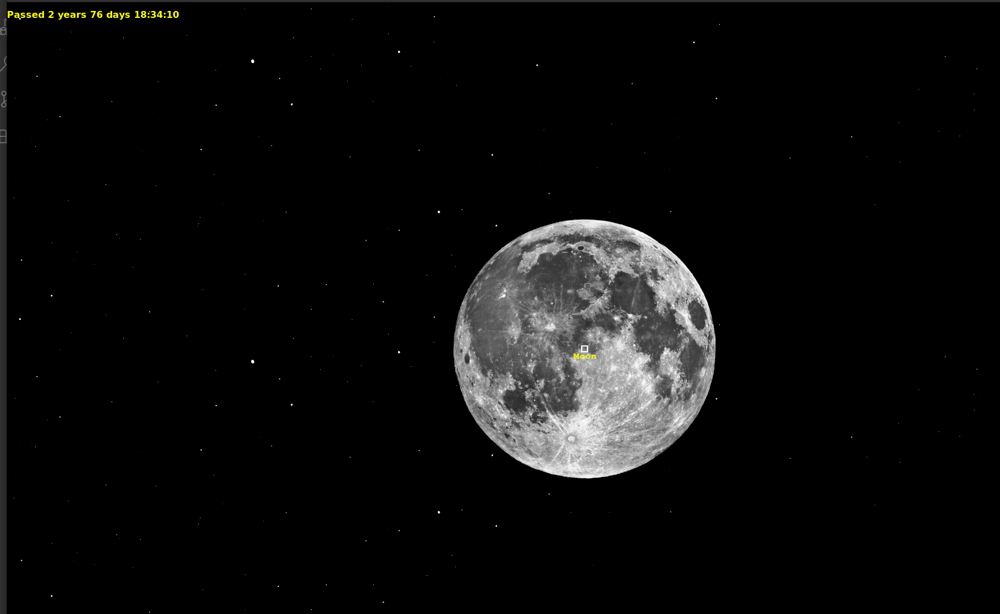
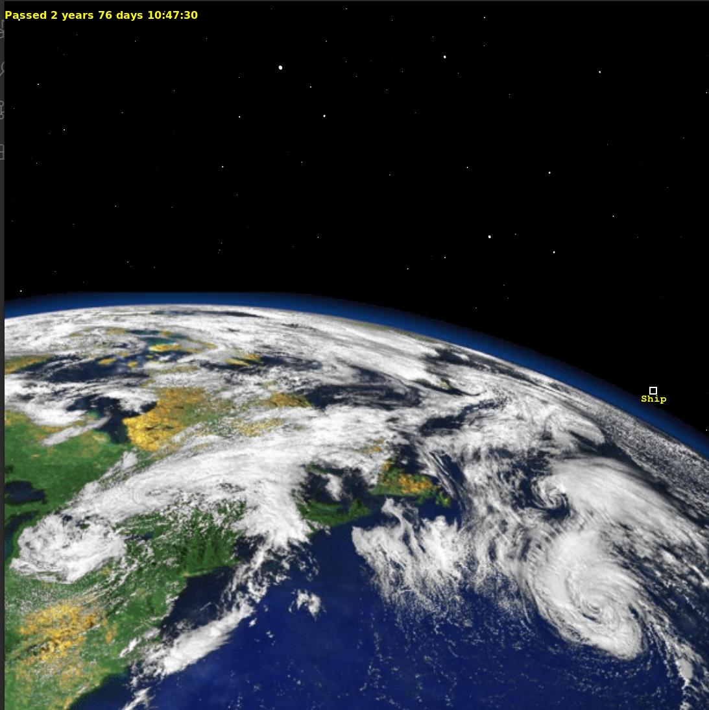

# Let's bring some physics to the CodeDay?
## Intro
In this project I created a simulator of a space ship and other object trajectories in our Sol system.

To make things more interesting I decided to write it in C++ with almost no prior experience in it.
## Project Details
### Physics
I just decided to pretend that an object's acceleration and speed remain the same during a short time interval (e.g. 1 minute) and use simple physics to update coordinates and speed. So, the program repeats the following steps in an infinitive loop for each object:
1. calculate new acceleration from gravitation forces;
2. calculate new speed pretending acceleration is the same during a time interval;
3. calculate new positions pretending the speed remains the same.

At the very end I figured out there is already such method introduced by Euler -)

### Instruments
1. C++;
2. Some makefile magic copied from some github project;
3. SDL2 (Simpel DirectMedia Layer) library for drawing. It's not that simple in C++, actually;
4. cairo library for actual drawing.

## Results and Archivements
I managed to add Sun, Earth, Moon and a space ship and physics for them. Implemented some drawing with control for the simulation speed, scale, center coordinate switchable between the objects.

This simple approach gives amazing results - the Earth does rotate around the Sun in 365 days, the first cosmic and escape speeds for Earth match the numbers from Wikipedia.

Screenshots: 

## Controls

- 'i' - Zoom In
- 'o' - Zoom Out
- 's' - Slow down simulation speed
- 'f' - Speed up simulation
- '1' - Make the Sun to be the center
- '2' - Make the Earth to be the center
- '3' - Make the Moon to be the center
- '4' - Make the ship to be the center

## Have not finished

It will be a long list but the main is to be able to setup the ship position without modifying the source code.

